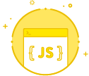

  

<h1 align="center">JavaScript (ES5)</h1>

A versatile language used anywhere from interactive websites to backend servers.

## JavaScript (ES5) I

JavaScript is a programming language that's used in many parts of web development, from frontend to backend. In this lesson, we'll learn about its basic syntax.

[Study 01](./study_01)

## JavaScript (ES5) II

In this lesson, we'll learn about booleans and if statements. Things get a little tricky from here, but let's master them one by one!

[Study 02](./study_02)

## JavaScript (ES5) III

In this lesson, we'll learn about "loops" which is convenient for repeating the same code many times. We'll also study how to use arrays, such as associative arrays.

[Study 03](./study_03)

## JavaScript (ES5) IV

In this lesson, we'll learn how to define and call "functions", which combine multiple processes into one. Let's clear the lesson and master the basics of JavaScript!

[Study 04](./study_04)
